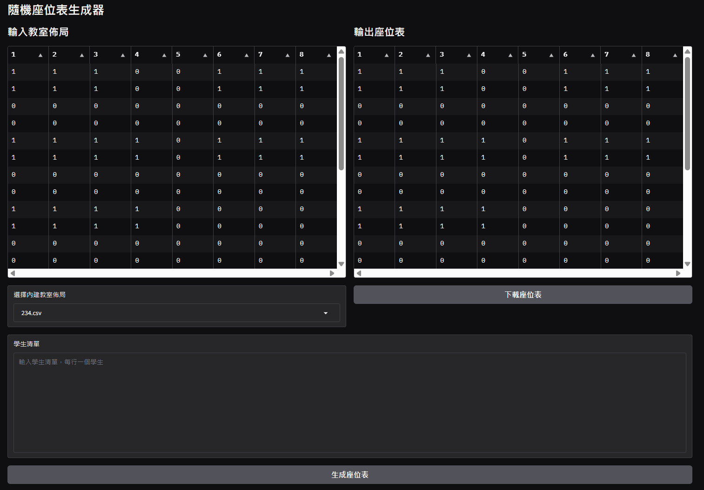

# SeatingChartGenerator

用來生成隨機座位表的小工具




## 環境
- Python 3.11.9
```bash
pip install -r requirements.txt
```

## 使用方法
```bash
python src/main.py
```
### 1. 載入座位表佈局
在左邊的表格中輸入座位表佈局，`1` 為座位，`0` 為空位，可以使用其他中文標記座位，例如 `講座`。

### 2. 載入學生名單
在下方的輸入欄位中填入學生名單，每行一個學生。
舉例：
```
學生1
學生2
學生3
```

### 3. 生成座位表
點擊 `生成座位表` 按鈕，即可生成隨機座位表。

### 4. 下載座位表
點擊 `下載座位表` 按鈕，即可下載 `seating_chart.csv` 檔案。